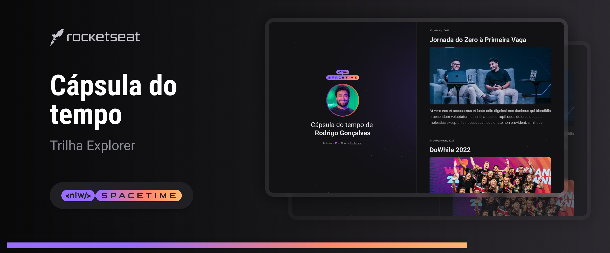

## 💻 Projeto 
Esse é um projeto Web Responsivo para exibir memórias em uma linha do tempo

## 🚀 Tecnologias
Esse projeto foi desenvolvido durante o NLW da Rocketseat com as seguintes tecnologias:

- HTML
- CSS
- GIT e GITHUB
